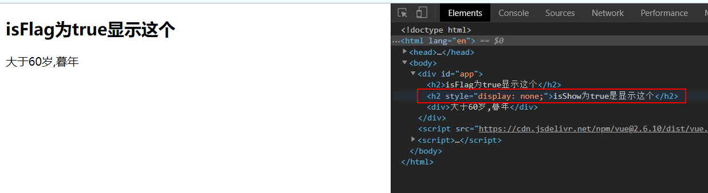
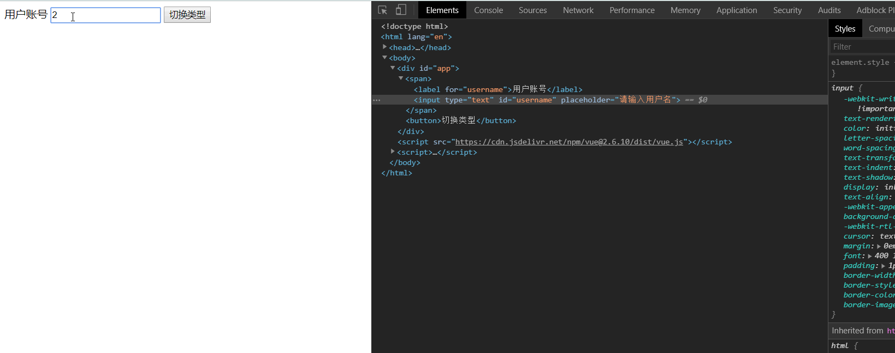

# （七）条件判断


## 7.1	v-if、v-eles、v-else-if

​	v-if用于条件判断，判断Dom元素是否显示。

```html
<!DOCTYPE html>
<html lang="en">
<head>
  <meta charset="UTF-8">
  <meta name="viewport" content="width=device-width, initial-scale=1.0">
  <meta http-equiv="X-UA-Compatible" content="ie=edge">
  <title>Document</title>
</head>
<body>
  <div id="app">
    <h2 v-if="isFlag">isFlag为true显示这个</h2>
    <h2 v-show="isShow">isShow为true是显示这个</h2>
    <div v-if="age<18">小于18岁未成年</div>
    <div v-else-if="age<60">大于18岁小于60岁正值壮年</div>
    <div v-else="">大于60岁,暮年</div>
  </div>
  <script src="https://cdn.jsdelivr.net/npm/vue@2.6.10/dist/vue.js"></script>
  <script>
    const app = new Vue({
      el:"#app",
      data:{
        isFlag:true,
        isShow:false,
        age:66
      }
    })
  </script>
</body>
</html>
```

1. 单独使用v-if，变量为布尔值，为true才渲染Dom

2. v-show的变量也是布尔值，为true才显示内容，类似css的display

3. v-if、v-else、v-else-if联合使用相当于if、elseif、else，但是在条件比较多的时候建议使用计算属性。

   


## 7.2	v-if的demo

​	在登录网站是经常可以选择使用账户名或者邮箱登录的切换按钮。要求点击按钮切换登录方式。

```html
<!DOCTYPE html>
<html lang="en">
<head>
  <meta charset="UTF-8">
  <meta name="viewport" content="width=device-width, initial-scale=1.0">
  <meta http-equiv="X-UA-Compatible" content="ie=edge">
  <title>Document</title>
</head>
<body>
  <div id="app">
    <span v-if="isUser">
      <label for="username">用户账号</label>
      <input type="text" id="username" placeholder="请输入用户名" >
    </span>
    <span v-else="isUser">
        <label for="email">用户邮箱</label>
        <input type="text" id="email" placeholder="请输入用户邮箱" >
    </span>
    <button @click="isUser=!isUser">切换类型</button>
  </div>
  <script src="https://cdn.jsdelivr.net/npm/vue@2.6.10/dist/vue.js"></script>
  <script>
    const app = new Vue({
      el:"#app",
      data:{
        isUser:true
      }
    })
  </script>
</body>
</html>
```

​	使用`v-if`和`v-else`选择渲染指定的Dom，点击按钮对`isUser`变量取反。

> 这里有个小问题，如果已经输入了账号了，此时想切换到邮箱输入，输入框未清空。



​	这里需要了解一下vue底层操作