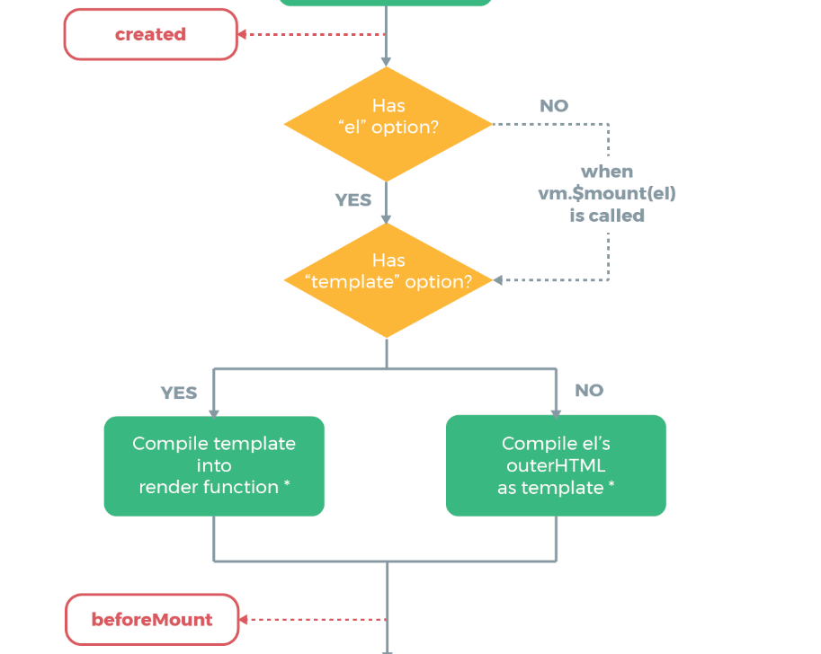

# （十三）Vue实例的生命周期

## 13.1	 <span id="top">生命周期图</span>

​	Vue实例的生命周期中有多个状态。


> 测试代码

```html
<!DOCTYPE html>
<html lang="en">
<head>
    <meta charset="UTF-8">
    <meta name="viewport" content="width=device-width, initial-scale=1.0">
    <meta http-equiv="X-UA-Compatible" content="ie=edge">
    <title>Vue实例的生命周期</title>

    <!-- 引入vue.js -->
    <script src="https://cdn.jsdelivr.net/npm/vue@2.6.10/dist/vue.js"></script>
</head>
<body>
    <div id="app">
        <h1>测试生命周期</h1>
        <div>{{msg}}</div>
        <hr>
        <h3>测试beforeUpdate和update两个钩子函数</h3>
        <button @click="handlerUpdate">更新数据</button>
    </div>
    <script>
        var app = new Vue({
            el:"#app",
            data:{
                msg:"12345"
            },
            methods: {
                handlerUpdate:function(){
                    this.msg=this.msg.split("").reverse().join("");
                },
            },//按照示意图依次调用
            beforeCreate:function(){
                console.log("调用了beforeCreate钩子函数");
            },
            created:function () {
                console.log("调用了created钩子函数");
            },
            beforeMount: function () {
                console.log('调用了beforeMount钩子函数')
            },
            mounted: function () {
                console.log('调用了mounted钩子函数')
            },
            beforeUpdate: function () {
                console.log("调用了beforeUpdate钩子函数")
            },
            updated: function () {
                console.log("调用了updated钩子函数");
            },
            beforeDestroy: function () {
                console.log("调用了beforeDestroy钩子函数")
            },
            destroyed: function () {
                console.log("调用了destroyed钩子函数");
            },
        });
    </script>
</body>
</html>
```

如图所示：


初始化页面依次调用了：

> 1. 调用了beforeCreate钩子函数
> 2. 调用了created钩子函数
> 3. 调用了beforeMount钩子函数
> 4. 调用了mounted钩子函数

点击更新数据后：

`12345`变成了`54321`，此时调用了：

> 1. 调用了beforeUpdate钩子函数
> 2. 调用了updated钩子函数

打开F12控制台
直接输入`app.$destroy()`主动销毁Vue实例调用：

>1. 调用了beforeDestroy钩子函数
>2. 调用了destroyed钩子函数

## 13.2	再探究

### 13.2.1	beforeCreate之前

初始化钩子函数和生命周期

### 13.2.2	beforeCreate和created钩子函数间的生命周期

在beforeCreate和created之间，进行数据观测(data observer) ，也就是在这个时候开始监控data中的数据变化了，同时初始化事件。
<span style="float:right;">[生命周期展示图](#1)</span>

### 13.2.3	created钩子函数和beforeMount间的生命周期

对于created钩子函数和beforeMount有判断：


#### 13.2.3.1el选项对生命周期影响

>1. 有el选项

    new Vue({
        el: '#app',
        beforeCreate: function () {
            console.log('调用了beforeCreat钩子函数')
        },
        created: function () {
            console.log('调用了created钩子函数')
        },
        beforeMount: function () {
            console.log('调用了beforeMount钩子函数')
        },
        mounted: function () {
            console.log('调用了mounted钩子函数')
        }
    })

结果:


>2. 无el选项

    new Vue({
        beforeCreate: function () {
            console.log('调用了beforeCreat钩子函数')
        },
        created: function () {
            console.log('调用了created钩子函数')
        },
        beforeMount: function () {
            console.log('调用了beforeMount钩子函数')
        },
        mounted: function () {
            console.log('调用了mounted钩子函数')
        }
    })

结果：


>证明没有el选项，则停止编译，也意味着暂时停止了生命周期。生命周期到created钩子函数就结束了。而当我们不加el选项，但是手动执行vm.$mount(el)方法的话，也能够使暂停的生命周期进行下去，例如：

    var app = new Vue({
        beforeCreate: function () {
            console.log('调用了beforeCreat钩子函数')
        },
        created: function () {
            console.log('调用了created钩子函数')
        },
        beforeMount: function () {
            console.log('调用了beforeMount钩子函数')
        },
        mounted: function () {
            console.log('调用了mounted钩子函数')
        }
    })
    app.$mount('#app')

结果：


#### 13.2.3.2	template


>同时使用`template`和`HTML`，查看优先级：

        <h1>测试template和HTML的优先级</h1>
        <div id="app">
            <p>HTML优先</p>
        </div>
        <script>
            var app = new Vue({
                el:"#app",
                data:{
                    msg:"template优先"
                },
                template:"<p>{{msg}}</p>",
            });
        </script>

结果：


>结论

1. 如果Vue实例对象中有template参数选项，则将其作为模板编译成render函数
2. 如果没有template参数选项，则将外部的HTML作为模板编译（template），也就是说，template参数选项的优先级要比外部的HTML高
3. 如果1,2条件都不具备，则报错

>注意

1. Vue需要通过el去找对应的template，Vue实例通过el的参数，首先找自己有没有template，如果没有再去找外部的html，找到后将其编译成render函数。
2. 也可以直接调用[render](https://cn.vuejs.org/v2/api/#render)选项，优先级：`render函数选项  > template参数  > 外部HTML`。

<hr>


    new Vue({
        el: '#app',
        render (createElement) {
            return (....)
        }
    })

### 13.2.4	beforeMount和mounted钩子函数间的生命周期


>beforeMount

载入前（完成了data和el数据初始化），但是页面中的内容还是vue中的占位符，data中的message信息没有被挂在到Dom节点中，在这里可以在渲染前最后一次更改数据的机会，不会触发其他的钩子函数，一般可以在这里做初始数据的获取。

>Mount

载入后html已经渲染(ajax请求可以放在这个函数中)，把vue实例中的data里的message挂载到DOM节点中去

>这里两个钩子函数间是载入数据。

### 13.2.5	beforeUpdate钩子函数和updated钩子函数间的生命周期


在Vue中，修改数据会导致重新渲染，依次调用beforeUpdate钩子函数和updated钩子函数

如果待修改的数据没有载入模板中，不会调用这里两个钩子函数

    var app = new Vue({
        el: '#app',
        data: {
            msg: 1
        },
        template: '<div id="app"><p></p></div>',
        beforeUpdate: function () {
            console.log('调用了beforeUpdate钩子函数')
        },
        updated: function () {
            console.log('调用了updated钩子函数')
        }
    })
    app.msg = 2

结果：

如果绑定了数据，会调用两个钩子函数：

    <h1>测试有数据绑定修改数据，钩子函数调用情况</h1>
    <div id="app">
    </div>
    <script>
        var app = new Vue({
            el:"#app",
            template:"<p>{{msg}}</p>",
            data:{
                msg:"原数据"
            },
            beforeUpdate: function () {
                console.log("调用了beforeUpdate钩子函数")
            },
            updated: function () {
                console.log("调用了updated钩子函数");
            },
        });
        app.msg = "数据被修改了";
    </script>

结果：


>注意只有写入模板的数据才会被追踪

### 13.2.6	beforeDestroy和destroyed钩子函数间的生命周期


#### 13.2.6.1	beforeDestroy

销毁前执行（$destroy方法被调用的时候就会执行）,一般在这里善后:清除计时器、清除非指令绑定的事件等等…’)

#### 13.2.6.2	destroyed

销毁后 （Dom元素存在，只是不再受vue控制）,卸载watcher，事件监听，子组件

>总结

- beforecreate : 可以在这加个loading事件
- created ：在这结束loading，还做一些初始数据的获取，实现函数自-执行
- mounted ： 在这发起后端请求，拿回数据，配合路由钩子做一些事情
- beforeDestroy： 你确认删除XX吗？
- destroyed ：当前组件已被删除，清空相关内容


<hr>
<div>
  <span style="float:left;"><a href="#top">返回顶部</a></span><span style="float:right;"><a href="../README.md">返回首页</a></span>
</div>

[返回顶部](#top)																												[返回首页](../README.md)																										


