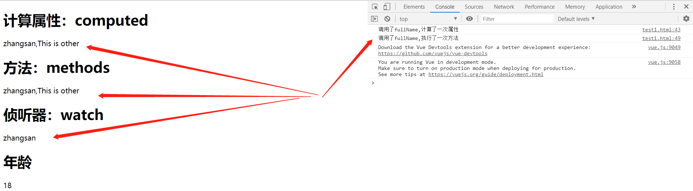

# Vue计算属性与侦听器
>照例看一段代码：

    <!DOCTYPE html>
    <html lang="en">
    <head>
        <meta charset="UTF-8">
        <meta name="viewport" content="width=device-width, initial-scale=1.0">
        <meta http-equiv="X-UA-Compatible" content="ie=edge">
        <title>Vue计算属性/侦听器/方法比较</title>
        
    </head>
    <body>
        

            <h1>计算属性：computed</h1>
            {{fullName}}
            <h1>方法：methods</h1>
            {{fullName2()}}
            <h1>侦听器：watch</h1>
            {{watchFullName}}
            <h1>年龄</h1>
            {{age}}
        

        
    </body>
    </html>

- 初始化：

- 修改firstName/lastName/两者都修改

- 修改computed中没计算的age

- 修改Vue实例外的对象

- 修改Vue实例外对象后在修改Vue实例内的对象

- 测试结论：
    1. 使用computed计算了fullName属性，值为firstName+lastName。计算属性具有`缓存功能`，当firstName和lastName都不改变的时候，fullName不会重新计算，比如我们改变age的值，fullName的值是不需要重新计算的.
    2. methods并没有缓存特性，比如我们改变age的值，fullName2()方法会被执行一遍
    3. 当一个功能可以用上面三个方法来实现的时候，明显使用computed更合适，代码简单也有缓存特性。
    4. 计算属性范围在vue实例内，修改vue实例外部对象，不会重新计算渲染，但是如果先修改了vue实例外对象，在修改vue计算属性的对象，那么外部对象的值也会重新渲染。
>计算属性：computed

计算属性范围在Vue实例的fullName内所管理的firstName和lastName,通常监听多个变量

>侦听器：watch

监听数据变化，一般只监听一个变量或数组

>使用场景

watch(`异步场景`)，computed(`数据联动`)

## computed的getter/setter
请看如下代码：

    <!DOCTYPE html>
    <html lang="en">
    <head>
        <meta charset="UTF-8">
        <meta name="viewport" content="width=device-width, initial-scale=1.0">
        <meta http-equiv="X-UA-Compatible" content="ie=edge">
        <title>Vue计算属性的getter和setter</title>
        
    </head>
    <body>
        

            <h1>计算属性：computed的getter/setter</h1>
            <h2>fullName</h2>
            {{fullName}}
            <h2>firstName</h2>
            {{firstName}}
            <h2>lastName</h2>
            {{lastName}}
        

        
    </body>
    </html>
>初始化

>修改fullName

>结论

- 通过这种方式，我们可以在改变计算属性值的同时也改变和计算属性相关联的属性值。